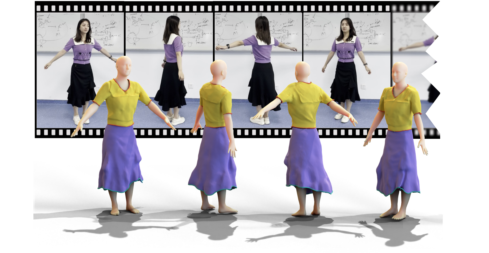

# REC-MV: REconstructing 3D Dynamic Cloth from Monucular Videos (CVPR2023)

[](https://opensource.org/licenses/Apache-2.0) 
<a href="https://pytorch.org/get-started/locally/"></a>

## [Project Page](https://lingtengqiu.github.io/2023/REC-MV/) | [Paper](https://lingtengqiu.github.io/2023/REC-MV/) 

This is the official PyTorch implementation of [REC-MV](https://lingtengqiu.github.io/2023/REC-MV/).

we will release the code soon.

**As patent pending, if you are interesting in our works, please do not hesitate to contact me to obtain paper.**

## TODO:triangular_flag_on_post:

- [x] Preprocess datasets
- [x] Pretrained weights
- [x] Demo
- [x] Training Code
- [ ] Combine with NeuralUDF (Comming Soon!)

## Requirements

Python 3
Pytorch3d (0.4.0, some compatibility issues may occur in higher versions of pytorch3d)

PyTorch<=1.10.2

[pytorch-scatter==2.0.9](https://github.com/rusty1s/pytorch_scatter)

Note: A GTX 3090 is recommended to run REC-MV, make sure enough GPU memory if using other cards.

## Install
```bash
conda env create REC-MV
conda activate REC-MV
pip install -r requirements.txt
bash install.sh
```

It is recommended to install pytorch3d 0.4.0 from source.

```bash
wget -O pytorch3d-0.4.0.zip https://github.com/facebookresearch/pytorch3d/archive/refs/tags/v0.4.0.zip
unzip pytorch3d-0.4.0.zip
cd pytorch3d-0.4.0 && python setup.py install && cd ..
```

To download the [SMPL](https://smpl.is.tue.mpg.de/) models from [here](https://mailustceducn-my.sharepoint.com/:f:/g/personal/jby1993_mail_ustc_edu_cn/EqosuuD2slZCuZeVI2h4RiABguiaB4HkUBusnn_0qEhWjQ?e=c6r4KS) and move pkls to smpl_pytorch/model.

To download DeepFashion3D templates with feature curve labels from [here](https://cuhko365-my.sharepoint.com/:u:/g/personal/220019047_link_cuhk_edu_cn/EV_AEn_SO0FBuMQUClRCR3IB0FMiOQQgHaCb-cKpUgKjow?e=bnyFyi) and  move this folder to ../smpl_clothes_template


## A Gentle Introduction



Reconstructing dynamic 3D garment surfaces with open boundaries from monocular videos is an important problem as it provides a practical and low-cost solution for clothes digitization. Recent neural rendering methods achieve high-quality dynamic clothed human reconstruction results from monocular video, but these methods cannot separate the garment surface from the body. To address the above limitations, in this paper, we formulate this task as an optimization problem of 3D garment feature curves and surface reconstruction from monocular video. We introduce a novel approach, called REC-MV, to jointly optimize the explicit feature curves and the implicit signed distance field (SDF) of the garments. Then the open garment meshes can be extracted via garment template registration in the canonical space. 


## Preprocess Datasets

<details>
<summary> Click to expand </summary>

#### SMPL Prediction

The preprocessing of  dataset is described here. If you want to optimize your own data, you can run [VideoAvatar](https://graphics.tu-bs.de/people-snapshot) or [TCMR ](https://github.com/hongsukchoi/TCMR_RELEASE)to get the initial SMPL estimation. Surely,  you can use your own SMPL initialization and normal prediction method then use REC-MV to reconstruct.

#### Normal map Prediction

To enable our normal optimization, you have to install [PIFuHD](https://shunsukesaito.github.io/PIFuHD/) and [Lightweight Openpose](https://github.com/Daniil-Osokin/lightweight-human-pose-estimation.pytorch) in your $ROOT1 and $ROOT2 first. Then copy generate_normals.py and generate_boxs.py to $ROOT1 and $ROOT2 seperately, and run the following code to extract normals before running REC-MV:

```bash
cd $ROOT2
python generate_boxs.py --data $ROOT/video-category/imgs
cd $ROOT1
python generate_normals.py --imgpath $ROOT/video-category/imgs
```

#### Parsing Foreground  Mask

We utilize a awesome [RobustVideoMatting](https://github.com/PeterL1n/RobustVideoMatting) to parsing human mask from monocular Videos.

#### Parsing Garment Semantic label.

[Self-Correction-Human-Parsing](https://github.com/GoGoDuck912/Self-Correction-Human-Parsing) is employed to segment garment labels. Note that we find **ATR** pretrained weight is better than other checkpoints, so we suggest you to load the **ATR** checkpoint.

#### Initialized Voxel Skinning Weights.

To better model skirts or dresses skinning weights, we apply [fite](https://github.com/jsnln/fite) to diffuse skinning weights into the whole voxel space. Specifically, we initialized skinning weights as the step1 said([Link](https://github.com/jsnln/fite))

The following commands give you an example to obtain PeopleSnapshot diffused skinning weights.

```bash
#!/bin/bash
#! example for processing people snapshot
# name_list=( female-3-casual female-3-sport female-4-casual female-6-plaza female-7-plaza )
name_list=( male-2-casual )
for name in ${name_list[@]}; do
    python -m step1_diffused_skinning.compute_diffused_skinning --config configs/step1/${name}.yaml
done

# clean tmp files
rm -rf ./data_tmp_constraints/*
rm -rf ./data_tmp_skinning_grid/*
```

#### Preprocess Datasets from Ours.

We provide links to the datas we have already processed

##### OneDrive

- [PeopleSnapshot](https://cuhko365-my.sharepoint.com/:u:/g/personal/220019047_link_cuhk_edu_cn/EYS0ivryIX1MnZtBbs8u_ccBHFFUjZQQpsO9WMWy665R1A?e=LWbXTD)
- [CUHKszCap-A](https://cuhko365-my.sharepoint.com/:u:/g/personal/220019047_link_cuhk_edu_cn/EaDhqIkcY5lEhIi5U9f-yqEB_MGv78TWtFycWxc_uSPL6g?e=6NQntH)
- [CUHKszCap-L](https://cuhko365-my.sharepoint.com/:u:/g/personal/220019047_link_cuhk_edu_cn/EaVVeJlkwmVPlRLAgb3-_KQBQviHrTAp9txR-HBgynxZIQ?e=48v5eQ)

##### Baidu Drive

- [PeopleSnapshot](https://pan.baidu.com/s/1QqBPWok-RDmQ_ZbJpqnJMQ?pwd=whdm)
- [CUHKszCap-A](https://pan.baidu.com/s/1XX0bZyPG2Hci-ynA31mcKw?pwd=grx5) 
- [CUHKszCap-L](https://pan.baidu.com/s/1gwMfqLyrRxdk8ru02gG9nQ?pwd=e0as)

The dataset folder is like the following example:

```bash
xxx_tic/
├── xxx_tic_diffused -> /data4/lingtengqiu/REC-MV/CUHKszCAP/xxx_tic_diffused/
├── xxx_tic_large_pose -> /data4/lingtengqiu/REC-MV/CUHKszCAP/xxx_tic_large_pose/
├── xxx_tic_tcmr_output.pkl
├── camera.npz
├── diffused_skinning_weights.npy
├── featurelines -> ../featurelines/xxx_tic
├── imgs
│   ├── 000000.jpg
│   ├── 000000_rect.txt
│   ├── 000001.jpg
│   ├── 000001_rect.txt
├── mask2fl
│   ├── 000000.json
│   ├── 000015.json
├── masks
│   ├── 000000.png
│   ├── 000001.png
├── normals
│   ├── 000000.png
│   ├── 000001.png
├── parsing_SCH_ATR
│   ├── 000000.npy
│   ├── 000000.png
│   ├── mask_parsing_000000.npy
├── result
│   ├── config.conf
│   └── debug
└── smpl_rec.npz
```

#### Preprocess your Dataset

The following commands give you a guidance to process your videos.

```bash
# An example to guide you to process your videos. Assuming you video data putted into folder, namely female_large_pose.
# and processed data folder denoted as female_large_pose_process_new.


# 1.data prepare
# e.g. openpose detection
bash ./scripts/openpose_predict.sh ./female_large_pose/${video-name}/ ./female_large_pose/${video-name}/joints2d
# parsing human mask
# parsing a human mask by RobustVideoMatting
# >>>>> https://github.com/PeterL1n/RobustVideoMatting
#e.g.
bash ./scripts/matting_video.sh 2 ./female_large_pose/${video-name}/imgs/ ./female_large_pose/${video-name}/body_masks ./female_large_pose/${video-name}/masks
# e.g. resize images to  [1080, 1080]

bash ./scripts/resize_video_imgs.sh ${video-name}
# video-avatar predict smpl results
# path: ~/cvpr2023/REC-MV/lib/videoavatars
# e.g.
bash ./scripts/build_large_pose.sh ${video-name}

# process videoavatar data to current datasets
python tools/people_aposefemale_process.py --root ~/cvpr2023/REC-MV/lib/videoavatars/datasets/${video-name}/ --save_root ./female_large_pose_process_new/${video-name}/

# prdice bbox
cd lib/lightweight-human-pose-estimation.pytorch/
python generate_boxs.py --data ./female_large_pose_process_new/${video-name}/imgs/
# predict normal map from pifuhd
cd -
cd lib/pifuhd/
python ./generate_normals.py --imgpath ./female_large_pose_process_new/${video-name}/imgs/
# predict TCMR, joints to optimize beta at the begining
bash ./scripts/get_smpl_from_video.sh ./$raw_video.mp4$ ${gpu_id}

#2. parsing garment mask
# detect or label 2d curve points from the key frames.
# e.g.
bash ./scripts/parsing_mask.sh 0 ./configs/female_large_pose_process_new/${video-name}.conf ./female_large_pose_process_new/${video-name}/
# parsing fl from two key points
python ./tools/parsing_mask_to_fl.py --parsing_type ATR  --input_path ./female_large_pose_process_new/${video-name}/ --output_path ./female_large_pose_process_new/${video-name}/mask2fl

#3. training
bash ./scripts/female_large_pose_process_new/${video-name}.sh ${gpu_id} ${save_folder} ${wandb_logger_name}
```

</details>

## Demo

Download the pretrained weights for self-rotated ([Onedrive](https://cuhko365-my.sharepoint.com/:u:/g/personal/220019047_link_cuhk_edu_cn/ERZz9kjjTuZLkMAXcsVxAE4BBGQ6CKUX6ue4Vatu-hYLhQ?e=3tKgvH)/[Baidu Drive](https://pan.baidu.com/s/1RpKCj-tnV9_88JAEUqQHQw?pwd=e15d))  and large motion([Onedrive](https://cuhko365-my.sharepoint.com/:u:/g/personal/220019047_link_cuhk_edu_cn/EaWwjlDBGfJHiZzg6vke7nwBY-MaqDszxExwZ3umeVlVBA?e=Mb7ARv)/[Baidu Drive](https://pan.baidu.com/s/1H6q_ftRy62wNAbcRoOsOtA?pwd=13ax)) into CUHKszCap-L/anran_tic (Note that you need download CUHKszCap-L first).


Download CUHKszCap-L, its checkpoints soft link to working space, like:

```bash

├── anran_tic_large_pose (large_pose checkpoint)
├── anran_tic_self_rotated (self-rotated checkpoint)
├── featurelines -> ../featurelines/anran_tic
├── imgs
├── mask2fl
├── masks
├── normals
├── parsing_SCH_ATR
└── result
    └── debug

```


Run the following code to generate  garment meshes from monocular videos.

```bash
# Download CUHKszCap-L, its checkpoints soft link to working space
ln -s ../xxx gap-female-largepose 
# 1.self-rotated garment capturing
# bash ./scripts/large_pose/test_large_pose_A_fl.sh ${gpu_id} ${subject_name} ${checkpoint name} 
bash ./scripts/large_pose/test_large_pose_A_fl.sh 2 anran_tic anran_tic_self_rotated
# 2.large-motion garment capturing
# ${gpu_id} ${subject_name} ${checkpoint name} 
bash ./scripts/large_pose/test_large_pose_A_fl.sh 2 anran_tic anran_tic_self_rotated
# generating video
# define pngs to video function
encodepngffmpeg()
{
	# $1: target folder
	# $2: save video name
    rm -rf ${2}
    ffmpeg -r ${1} -pattern_type glob -i '*.png' -vcodec libx264 -crf 18 -vf "pad=ceil(iw/2)*2:ceil(ih/2)*2" -pix_fmt yuv420p ${2}
}

# 3. producing self-rotated video
cd ./gap-female-largepose/anran_tic/anran_tic_self_rotated/colors
encodepngffmpeg 30 ./demo.mp4

# producing large-pose video
cd ./gap-female-largepose/anran_tic/anran_tic_large_pose/colors
encodepngffmpeg 30 ./demo.mp4


```

## Training

For training phase.

The  work direction likes the following folder tree:

```bash
├── a_pose_female_process -> ../../a_pose_female_process/
├── configs
│   ├── female_large_pose
│   ├── gap-female
│   ├── people_snapshot
│   └── sythe
├── dataset
│   └── __pycache__
├── debug
│   ├── register
│   └── smpl_beta
│       └── imgs
├── engineer
│   ├── core
│   │   └── __pycache__
│   ├── networks
│   │   └── __pycache__
│   ├── optimizer
│   │   └── __pycache__
│   ├── registry
│   ├── utils
│   │   └── __pycache__
│   └── visualizer
│       └── __pycache__
├── FastMinv
│   ├── build
│   │   ├── bdist.linux-x86_64
│   │   ├── lib.linux-x86_64-3.8
│   │   └── temp.linux-x86_64-3.8
│   ├── dist
│   └── FastMinv.egg-info
├── logs -> ../logs/
├── MCAcc
│   ├── cuda
│   │   ├── build
│   │   │   ├── bdist.linux-x86_64
│   │   │   ├── lib.linux-x86_64-3.8
│   │   │   └── temp.linux-x86_64-3.8
│   │   ├── dist
│   │   └── interplate.egg-info
│   └── __pycache__
├── MCGpu
│   ├── build
│   │   ├── bdist.linux-x86_64
│   │   ├── lib.linux-x86_64-3.8
│   │   └── temp.linux-x86_64-3.8
│   ├── dist
│   └── MCGpu.egg-info
├── model
│   └── __pycache__
├── people_snapshot_public_proprecess -> ../people_snapshot_public_proprecess/
├── preprocess
├── scripts
│   ├── gap-female
│   ├── large_pose
│   ├── people_snapshot
│   ├── preprocess
│   └── sythe
├── smpl_pytorch -> ../smpl_pytorch/
├── tools
└── utils
    └── __pycache__

```


Run the following code to fitting garment meshes from monocular videos.

```bash
# Training from scratch: self-rotated videos.

## Peoplesnapshot
### softlink preprocess peoplesnapshot dataset in ./REC-MV
ln -s ../people_snapshot_public_proprecess/ ./
### e.g. training codes
bash ./scripts/people_snapshot/train_female-3-casual.sh 0 ${exp_name} ${wandb name}

## Gap-Female
bash ./scripts/gap-female/train_anran_garment_fl.sh 1 anran_exp anran_exp

# Training for large motion video after self-rotated fitting 
## e.g. training codes
bash ./scripts/gap-female/train_anran_garment_fl.sh 1 ${exp_self_rotated_name} ${wandb name}
## copy self-rotated folder to large pose, and also its weights
cp -rd ./gap-female-largepose/anran_tic/${exp_self_rotated_name}/  cp -rd ./gap-female-largepose/anran_tic/${exp_large_pose_name}/
mv ./gap-female-largepose/anran_tic/${exp_large_pose_name}/latest.pth ./gap-female-largepose/anran_tic/${exp_large_pose_name}/a-pose.pth
bash ./scripts/gap-female/train_anran_garment_fl.sh 1 ${exp_large_pose_name} ${wandb name}

# Good luck in Garment-Verse.
```


## Citation

If you use REC-MV in your research, please consider the following BibTeX entry and giving us a star🌟!

```BibTeX
@inproceedings{qiu2023recmv
  title={REC-MV: REconstructing 3D Dynamic Cloth from Monucular Videos},
  author={Qiu, Lingteng and Chen, Guanying and Zhou, Jiapeng and Xu, Mutian and Wang, Junle, and Han, Xiaoguang},
  booktitle={CVPR},
  year={2023}
}
```

## Acknowledgements

Here are some great resources we benefit or utilize from:

- [SelfRecon](https://github.com/jby1993/SelfReconCode) and [Open-PIFuhd](https://github.com/lingtengqiu/Open-PIFuhd) for Our code base.

- [VideoAvatar](https://graphics.tu-bs.de/people-snapshot) and [TCMR ](https://github.com/hongsukchoi/TCMR_RELEASE) for SMPL initialization.
- [SMPL](https://smpl.is.tue.mpg.de/) for Parametric Body Representation
- [Self-Correction-Human-Parsing](https://github.com/GoGoDuck912/Self-Correction-Human-Parsing) for Garment Parsing
- [RobustVideoMatting](https://github.com/PeterL1n/RobustVideoMatting) for Foreground Parsing
- [PyTorch3D](https://github.com/facebookresearch/pytorch3d) for Differential Explicit Rendering
- [Fite](https://github.com/jsnln/fite) for Skinning weights initialization

 
